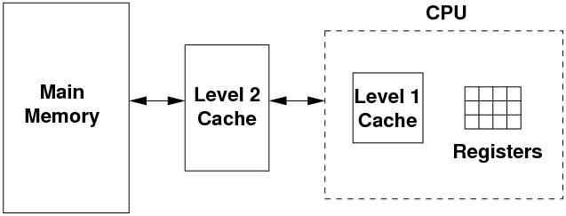
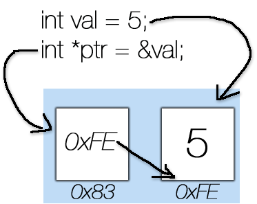

# C++ 2강: Scope, Stack, Reference, Pointer, const 등
SCSC 장필식

---

# 시공의 폭풍으로

강의를 들으면서 이해가 안되는 내용이 있으면 바로 얘기해 주세요

---

# 함수

아마 다 해본 내용이여서 간략하게만 하자면...

---

# 함수

함수는 반드시 쓰기 전에 정의되어야 한다.

```cpp
int sum(int a, int b) {
    return a + b;
}

int main() {
    cout << sum(1, 2) << endl;
}
```

---

# 함수

```cpp
int main() {
    // Error: function not defined
    cout << sum(1, 2) << endl; 
}

int sum(int a, int b) {
    return a + b;
}
```

---

# 함수 - Forward declaration

다음과 같이 미리 함수를 정의해 놓을 수 있다.

```cpp
int sum(int a, int b);

int main() {
    cout << sum(1, 2) << endl;
}

int sum(int a, int b) {
    return a + b;
}
```

---

# 함수 - Function overloading

같은 이름으로도 여러 종류의 패러미터를 받는 함수를 만들 수 있다.

```cpp
int sum(int a, int b) {
    return a + b;
}
float sum(float a, float b) {
    return a + b;
}
int main() {
    cout << sum(1, 2) << endl;
    cout << sum(1.1f, 2.4f) << endl;
}
```

주의: 다른 리턴 타입만 가지는 함수는 만들 수 없다.

---

# 변수의 수명

```cpp
int main()
{
    int a = 1;
    int b = 2;
    b = 3;
}
```

---

# Scope 의 중요성

Scope는 변수의 수명 (lifetime)을 제한하는 역할을 한다!
{}로 scope를 생성할 수 있다.

```cpp
int main()
{
    int a = 1;
    {
        int b = 2;
    } // <--- 여기까지가 b의 수명 
    b = 3; // 에러: b를 더이상 접근할 수 없음
}
```

---

# Scope의 종류: Block scope

```cpp
int a = 1;
if (a == 1) {
    int b = 2;
    a += b;
}
```

---

# Scope의 종류: Function scope

```cpp
int addNumbers(int n) { // n: function prototype scope
    int sum = 0; // sum; function scope
    for (int i = 1; i <= n; ++i) {
        sum += i;
    }
    return sum;
}
int main() {
    cout << addNumbers(10) << endl;
}

```

---

# 레퍼런스

오브젝트를 다른 명칭으로 부르는 방법

```cpp
int val = 1;
int &refVal = val;
refVal = 0; // ival changes to 0
```

- ``refVal``는 ``val``에 대한 또다른 이름이 될 뿐.
- ``refVal``는 **reference type**이고, val에 대한 reference이다.
- 이 때 refVal를 ival에게 bind한다고 말한다.

---

# 레퍼런스

```cpp
int ival = 1;
int ival2 = 2;
int &refVal; // error: a reference must be initialized
int &refVal2 = ival; // refVal3 refers to ival, ival = 1
refVal2 = ival2; // refVal3 refers to ival, ival = 2
```

레퍼런스는 생성이 될 때 바로 bind가 되야함.

레퍼런스는 한번 bind가 되면 다른 변수로 bind가 될 수 없음. (no rebind)

---

# Reference == Alias

```cpp
int val = 1;
int &refVal = val;
refVal = 2;
int ii = refVal;
int &refVal3 = refVal;
int i = refVal;
```

refVal를 쓸때마다 사실은 val를 쓰는것과 같다.

주의: 레퍼런스는 오브젝트가 아니다! 즉 레퍼런스의 레퍼런스를 정의할 수 없다.

---

# 포인터

C/C++을 배우는 사람들에게 공포를 안겨주는 녀석.

포인터가 왜 두려운가?

---

# 실제 변수들은 어디에 있을까? 

```cpp
#include <iostream>
using namespace std;
int main() {
    int a = 1;
    int b = 2;
    int c = 3;
    cout << a << b << c << endl;
}
```
가장 많이 사용하는 변수들은 CPU의 레지스터에 저장된다.
나머지는 메모리라는 곳에 저장되게 된다.

---

# 메모리의 구조



---

# Stack and Heap

메모리는 크게 두 종류로 나누어져 있다.
- Stack는 메모리의 높은 주소부터 아래로 차고,
- Heap는 메모리의 낮은 주소부터 위로 찬다.

아직까지 우리는 거의 Stack에서만 놀 것이다.
(Heap memory 사용은 추후에)

---

# Stack

```cpp
int main() {
    int a = 1;
    int b = 2;
    int c = 3;
}
```

---

# Stack Frame

```cpp
int fun1() {
    int c = 3;
}
int main() {
    int a = 1;
    int b = 2;
}
```

---

# Stack Frame

```cpp
int sum(int a, int b) {
    int c = a + b;
    return c;
}
int main() {
    int a = 1;
    int b = 2;
    int result = sum(a, b);
    cout << result << endl;
}
```

---

# Stack Frame (with recursion)

```cpp
int factorial(int n) {
    if (n == 0) return 1;
    else return n * factorial(n - 1);
}
int main() {
    int result = factorial(4);
    cout << result << endl;
}
```

---

# Exercise

```cpp
int fibonacci(int n) {
    if (n == 1 || n == 2) return 1;
    else return fibonacci(n-1) + fibonacci(n-2);
}
int main() {
    int result = fibonacci(5);
    cout << result << endl;
}
```

---

# "주소"와 "값"



---

# 포인터의 유용성

포인터를 사용하면 해당 stack frame에 우리가 원하는 값이 없어도 주소로 접근을 가능하게 해 준다!

예를 들어
- 해당 값이 함수 바깥의 stack frame에 있을 경우
- 해당 값이 heap에 있을 경우

---

# 포인터의 사용 방법

```cpp

```

---

# &, * 정리

왼쪽, &: reference declaration
```cpp
int &a = ...
```

왼쪽, \*: pointer declaration
```cpp
int *a = ...
```

오른쪽, &: address operator
```cpp
... = &a; 
```

오른쪽, \*: dereference operator
```cpp
... = *a;
```

---

# 흠... 그런데 이걸 왜 쓰는거죠?

- 다른 함수에서 기존에 있는 변수를 변경하고 싶을 때 유용하다.
- 변수의 주소를 통해 변수의 불필요한 복사를 줄일 수 있다.

---

# 예시: string 넘겨받기

pass by value로 넘겨줬을 때는 비효울적일 수도 있다.

```cpp
void greetPerson(std::string name) {
    cout << "Hello, " << name << "!" << endl;
}

int main() {
    greetPerson("Dongsu");
}
```

---

# 예시: string 넘겨받기

"Dongsu"라는 스트링을 복사하지 않기 위해서는 reference로 넘겨주는게 좋다.

```cpp
void greetPerson(std::string& name) {
    cout << "Hello, " << name << "!" << endl;
}

int main() {
    greetPerson("Dongsu");
}
```

---

# 예시: string 넘겨받기

그리고 우리는 이 reference를 변경하지 않을 것이기 때문에 const를 붙인다.
(const에 대한 설명은 좀 있다가)

```cpp
void greetPerson(const std::string& name) {
    cout << "Hello, " << name << "!" << endl;
}

int main() {
    greetPerson("Dongsu");
}
```

---

# 언제 value로 넘겨주고 언제 reference로 넘겨주지?

- 만약 변수를 함수 안에서 변경해야 한다면 reference로 넘겨줘야 한다.
그렇지 않다면...

- Primitive 타입(int, float, char, double 등) 혹은 크기가 작은 유저 타입에는 value로 넘겨주는 것이 좋다.
- 이외의 경우에는 reference로 넘겨주는 것이 더 효율적이다.

---

# 언제 value로 넘겨주고 언제 reference로 넘겨주지?

- 만약 변수를 함수 안에서 변경해야 한다면 reference로 넘겨줘야 한다.
그렇지 않다면...

- Primitive 타입(int, float, char, double 등) 혹은 크기가 작은 유저 타입에는 value로 넘겨주는 것이 좋다.
- 이외의 경우에는 reference로 넘겨주는 것이 더 효율적이다.
- **가 아니라...**


---

# 언제 value로 넘겨주고 언제 reference로 넘겨주지?

- 만약 변수를 함수 안에서 변경해야 한다면 reference로 넘겨줘야 한다.
그렇지 않다면...

C++11이 나오기 전까지는 그랬다. 하지만 지금은 다르다. 함수가 해당 argument 변수에 대한 소유권을 가지게 된다면 (즉 나중에도 함수 바깥에서 그 변수가 쓰이게 될 일이 없다면) value 타입으로 넘겨주길 바란다.

왜? 그건 몇 주 후에... (시공의 폭풍으로)
https://stackoverflow.com/questions/270408/is-it-better-in-c-to-pass-by-value-or-pass-by-constant-reference

---

# 즉 우린 이렇게 하자

```cpp
void greetPerson(std::string name) {
    cout << "Hello, " << name << "!" << endl;
}

int main() {
    greetPerson("Dongsu");
}
```

---

# 예시: swap function

```cpp
int a = 1;
int b = 2;

// code for swapping
int c = a;
a = b;
b = c;
```

---

# 예시: swap function

```cpp
void swapTwoNumbers(int a, int b) {
    int c = a;
    a = b;
    b = c;
}
```
결과는? 스왑이 안됨!

---

# 에시: swap function

```cpp
void swapTwoNumbers(int &a, int &b) {
    int c = a;
    a = b;
    b = c;
}
```

값 자체를 스위치.

---

# 예시: swap function

```cpp
void swapTwoNumbers(int *a, int *b) {
    int* c = a;
    a = b;
    b = c;
}
```
결과는? 스왑이 안됨! (왜 그럴까?)

---

# 예시: swap function

```cpp
void swapTwoNumbers(int *a, int *b) {
    int c = *a;
    *a = *b;
    *b = c;
}
```
문제점을 고친 후.

---

# 예시: swap function (STL)

하도 많이 쓰길래 사람들이 함수까지 이미 만들어 놓았다...
나중에 다시 한번 화려하게 등장할 예정.

```cpp
int main() {
    int a = 1;
    int b = 2;
    std::swap(a, b);
}
```

---

# 주의: Java/Python등과 C++의 차이점

Java/Python 등의 레퍼런스는 C++의 포인터에 더 가깝다!
```java
public class Main {
    static void changeNumber(Integer a) {
        a = new Integer(2);
    }
    public static void main(String[] args) {
        Integer a = new Integer(1);
        changeNumber(a);
        System.out.println(a); // print 1
    }
}
```
---

# 주의: Java/Python등과 C++의 차이점

```python
def change(arr):
    arr = [2]

def main():
    arr = [1]
    change(arr)
    print(arr)
    
```

---

# 주의: Java/Python등과 C++의 차이점

```cpp
void changeNumber(int& a) {
    a = 2;
}
int main() {
    int a = 1;
    changeNumber(a);
    cout << a << endl;
}
```

---

# Pass-by-value vs. pass-by-reference

Pass by reference
```cpp
void changeNumber(int& a) { ... }
```

Pass by value
```cpp
void changeNumber(int a) { ... }
```
```cpp
void changeNumber(int* a) { ... }
```

---

# 레퍼런스/포인터를 쓸 떄 주의할 점

Scope에서 벗어난 변수의 레퍼런스나 포인터를 가지고 있지 말자

```cpp
int *ptr;
{
    int val = 1;
    ptr = &val;
}
cout << *ptr; // Error: dereferencing an invalid pointer
```

---

# 레퍼런스/포인터를 쓸 때 주의할 점

```cpp
std::string& createGreeting(std::string name) {
    std::string str = "Hello, " + name + "!";
    return str; // Error: return a reference of a value which will be invalid
}
int main() {
    cout << createGreeting("Dongsu") << endl;
}
```

---

# 레퍼런스/포인터를 쓸 때 주의할 점
```cpp
std::string* createGreeting(std::string name) {
    std::string str = "Hello, " + name + "!";
    return &str; // Error: return a pointer of a value which will be invalid
}
int main() {
    cout << createGreeting("Dongsu") << endl;
}
```

---

# 레퍼런스/포인터를 쓸 때 주의할 점

올바른 방법: 
```cpp
std::string createGreeting(std::string name) {
    std::string str = "Hello, " + name + "!";
    return str;
}
int main() {
    cout << createGreeting("Dongsu") << endl;
}
```

---

# 악마의 const

const를 왜 붙여야 하고, 왜 쉽지 않은가

---

# const

const correctness

---

# const를 읽는 방법

오른쪽에서 왼쪽으로. 
~~여러분 같이 따라해보세요~~
```cpp
// pointer to an int
int* ptr;
// const pointer to an int
int* const ptr;
// pointer to an int which is const
const int* ptr; 
// const pointer to an int which is const
const int* const ptr;
```

---

# 끄으읕

모두 수고하셨습니다
