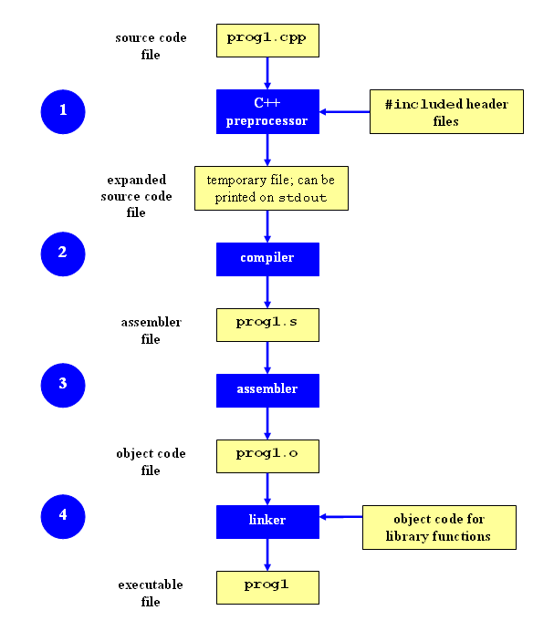

# C++ 5강: Simple class

---

# 목차

- struct
- constructor
- members
- private/public
- move to separate file

---

# 참고 자료

Accelerated C++, Chapter 9
C++ Primer, Chapter 7
en.cppreference.com
StackOverflow 글 몇개

---

# 우리만의 타입을 정의하자

드다어 OOP(Object-Oriented Programming)의 시작?

---

# 구조체

예: 어느 수업에서의 학생에 대한 정보

```cpp
struct StudentInfo {
    std::string name;
    double midterm, final;
    std::vector<double> homework;
}; // Don't forget the semicolon
```

여러가지 데이터를 하나로 묶어서 새로운 타입을 만들 수 있다.
구조체 안의 각각의 variable를 member variable라고 부른다.

---

# 구조체의 사용

```cpp
struct StudentInfo {
    std::string name;
    double midterm, final;
    std::vector<double> homework;
};

int main() {
    StudentInfo youngjae;
    youngjae.name = "youngjae";
    youngjae.midterm = 100.00;
    youngjae.final = 100.00;
    youngjae.homework = {100.00, 100.00, 100.00};
}
```

---

# 하지만... 좀 불편하다

member variable의 생성을 좀 더 쉽게 하는 방법이 없을까? Constructor!

```cpp
StudentInfo youngjae("youngjae", 100.00, 100.00);
cout << youngjae.midterm << endl;
cout << youngjae.final << endl;
```

---

# 오브젝트를 생성하는 여러가지 방법

```cpp
StudentInfo youngjae("youngjae", 100.00, 100.00);
StudentInfo youngjae {"youngjae", 100.00, 100.00};
auto youngjae = StudentInfo("youngjae", 100.00, 100.00);
```

요즘은 중괄호로 initialize를 하기도 하지만...
장점: https://stackoverflow.com/questions/18222926/why-is-list-initialization-using-curly-braces-better-than-the-alternatives

참고로 맨 아래것도 작동하긴 하지만, 불필요한 복사가 들어갈 것 같다...
하지만 실제로는 복사가 일어나지 않는다 (이유는 다음에)

---

# constructor

오브젝트를 생성하는 함수를 정의

<span style="font-size: 80%;">

```cpp
struct StudentInfo {
    StudentInfo(std::string _name, double _midterm, double _final) {
        name = _name;
        midterm = _midterm;
        final = _final;
    }
    std::string name;
    double midterm, final;
    std::vector<double> homework;
};
```

---

# 근데 보기 좀 더럽다

왜 패러미터에 ``name`` 대신에 ``_name``를 쓴거지?

member variable와 이럼이 겹쳐서... ㅠㅠ

---

# 해결책 1

<span style="font-size: 80%;">

```cpp
struct StudentInfo {
    StudentInfo(std::string name, double midterm, double final) {
        StudentInfo::name = name;
        StudentInfo::midterm = midterm;
        StudentInfo::final = final;
    }
    std::string name;
    double midterm, final;
    std::vector<double> homework;
};
```

---

# 해결책 2

<span style="font-size: 80%;">

```cpp
struct StudentInfo {
    StudentInfo(std::string name, double midterm, double final) {
        this->name = name;
        this->midterm = midterm;
        this->final = final;
    }
    std::string name;
    double midterm, final;
    std::vector<double> homework;
};
```

---

# this?

현재 오브젝트에 대한 포인터 변수. 이것을 통해서도 member variable를 접근할 수 있다.

->: 포인터 안에 있는 member variable를 가져올 때 사용

``obj->field``는 ``(*obj).field``와 동일함.

---

# constructor initialization list

만약에 각각의 member variable에 대한 constructor가 있다면, constructor initialization list를 통해 이들을 선언할 수 있다.

<span style="font-size: 80%;">

```cpp
struct StudentInfo {
    StudentInfo(std::string name, double midterm, double final) :
        name(name), midterm(midterm), final(final) { }

    std::string name;
    double midterm, final;
    std::vector<double> homework;
};
```

참고로 primitive type (int, double, ..)와 STL의 거의 모든 타입들 (string, vector, ...)에는 constructor가 달려있다.

---

# multiple constructors

<span style="font-size: 80%;">

```cpp
struct StudentInfo {
    StudentInfo(std::string name) :
        name(name), midterm(0.0), final(0.0) { }
        
    StudentInfo(std::string name, double midterm, double final) :
        name(name), midterm(midterm), final(final) { }
        
    StudentInfo(std::string name, double midterm, double final,
                const std::vector<double>& hw) :
        name(name), midterm(midterm), final(final), hw(hw) { }

    std::string name;
    double midterm, final;
    std::vector<double> homework;
};
```

---

# default constructor

<span style="font-size: 80%;">

```cpp
struct StudentInfo {
    StudentInfo() : name(""), midterm(0.0), final(0.0) {}
    StudentInfo(std::string name, double midterm, double final) :
        name(name), midterm(midterm), final(final) { }

    std::string name;
    double midterm, final;
    std::vector<double> homework;
};
```

---

# default constructor

만약에 모든 member variable들이 default constructor를 가지고 있다면, default keyword를 통해서 자동으로 default constructor를 만들어준다!

<span style="font-size: 80%;">

```cpp
struct StudentInfo {
    StudentInfo() = default;
    StudentInfo(std::string name, double midterm, double final) :
        name(name), midterm(midterm), final(final) { }

    std::string name;
    double midterm, final;
    std::vector<double> homework;
}
```

---

# default constructor

<span style="font-size: 80%;">

```cpp
struct StudentInfo {
    std::string name;
    double midterm, final;
    std::vector<double> homework;
}

StudentInfo dongsu; // called default constructor
// StudentInfo dongsu(); // ERROR: can't do this!
//                     (compiler is confused with function declaration)
StudentInfo dongsu {}; // also called default constructor
auto dongsu = StudentInfo(); // also called default constructor
```

근데 우리가 constructor를 정의해 준 적이 없어도 오브젝트는 잘 생성되었다.

왜??...

---

# automatic creation of default constructor

```cpp
struct StudentInfo {
    // compiler generates this for us
    // StudentInfo() = default;
    std::string name;
    double midterm, final;
    std::vector<double> homework;
}
```

컴파일러가 알아서 default constructor를 만들어주었기 때문이다!

---

# default constructor rules

만약에
- 모든 member variable에 default constructor가 정의되어 있고,
- 우리가 다른 constructor를 따로 정의하지 않았을 때

컴파일러가 default constructor를 만들어준다.

---

# constructor with default arguments

<span style="font-size: 80%;">

```cpp
struct StudentInfo {
    StudentInfo(std::string name,
                double midterm = 0.0, double final = 0.0) :
        name(name), midterm(midterm), final(final) { }

    std::string name;
    double midterm, final;
    std::vector<double> homework;
}
```

---

# declaring default constructor with default arguments

이렇게 해도 default constructor는 정의되었다!

<span style="font-size: 80%;">

```cpp
struct StudentInfo {
    StudentInfo(std::string name = "Default Student",
                double midterm = 0.0, double final = 0.0) :
        name(name), midterm(midterm), final(final) { }

    std::string name;
    double midterm, final;
    std::vector<double> homework;
}
```

```cpp
StudentInfo defaultStudent;
```

---

# constructor: 바깥에 정의

다음과 같이 바깥에 정의할 수도 있다.

<span style="font-size: 75%;">

```cpp
struct StudentInfo {
    StudentInfo(std::string name, double midterm, double final);

    std::string name;
    double midterm, final;
    std::vector<double> homework;
}

StudentInfo::StudentInfo(std::string name, double midterm, double final) :
    name(name), midterm(midterm), final(final) { }
```

이렇게 해야 하는 상황이 있을 수 있는데.... 이유는 나중에 설명.

---

# 하지만... 좀 싱겁다

이 오브젝트에 생기를 좀 불어넣자

- 학생의 평균 시험 점수를 계산하고 싶고
- 학생의 총 점수를 계산하고 싶다

---

# method

struct 안에 데이터 말고도 이 오브젝트에 유용한 함수들을 정의해 주자.

<span style="font-size: 80%;">

```cpp
struct StudentInfo {
    StudentInfo(std::string name, double midterm, double final) :
        name(name), midterm(midterm), final(final) { }

    void addHomework(double score);
    double testAverage() const;
    double grade() const;

    std::string name;
    double midterm, final;
    std::vector<double> homework;
};
```

---

# method 사용

<span style="font-size: 85%;">

```cpp
StudentInfo dongsu;
dongsu.midterm = 100;
dongsu.final = 100;
dongsu.addHomework(100);
dongsu.addHomework(100);
dongsu.addHomework(100);
cout << dongsu.testAverage() << ", " << dongsu.grade() << endl;
```

---

# method

우리는 이 함수들을 클래스 내에 아직 **정의**만 했다. 구현은 바깥에 해 주자.

<span style="font-size: 75%;">

```cpp
struct StudentInfo {
    StudentInfo(std::string name, double midterm, double final) :
        name(name), midterm(midterm), final(final) { }

    void addHomework(double score);
    double testAverage() const;
    double grade() const;

    std::string name;
    double midterm, final;
    std::vector<double> homework;
};

void StudentInfo::addHomework(double score) {
    homework.add(score);
}

double StudentInfo::testAverage() {
    return (midterm + final)/2;
}

double StudentInfo::grade() {
    return std::accumulate(homework.begin(), homework.end(), 0)
        / homework.size();
}
```

---

# method

아니면 이렇게 클래스 안에 함수의 구현을 넣을 수도 있긴 한데...

<span style="font-size: 80%;">

```cpp
struct StudentInfo {
    StudentInfo(std::string name, double midterm, double final) :
        name(name), midterm(midterm), final(final) { }

    void addHomework(double score) {
        homework.add(score);
    }
    double testAverage() const {
        return (midterm + final)/2;
    }
    double grade() const {
        return std::accumulate(homework.begin(), homework.end(), 0) 
            / homework.size();
    }

    std::string name;
    double midterm, final;
    std::vector<double> homework;
};
```

클래스가 많아지면 이런 방식으로 관리하기 힘들다. (이유는 좀 나중에...)

---

# const correctness

method에 const를 붙여주면 그 함수는 해당 오브젝트를 변형시킬 수 없다.
어느 함수가 데이터를 변경하지 않는다는 것을 명시해주기 위해 사용한다.

---

# 하지만... 좀 무섭다

클래스의 변수들과 함수들을 누구나 접근할 수 있다는 사실에 정신이 오락가락해지고 잠을 이룰 수 없다...


---

# public vs private

- public: 누구나 member variable과 method들을 접근할 수 있음

- private: 클래스 안에서만 member variable과 method들을 접근할 수 있음

---

# public vs private

<span style="font-size: 80%;">

```cpp
struct StudentInfo {
public:
    StudentInfo(std::string name, double midterm, double final) :
        name(name), midterm(midterm), final(final) { }

    void addHomework(double score) {
        homework.add(score);
    }
    double testAverage() const {
        return (midterm + final)/2;
    }
    double grade() const {
        return std::accumulate(homework.begin(), homework.end(), 0) 
            / homework.size();
    }

private: 
    std::string name;
    double midterm, final;
    std::vector<double> homework;
};
```

---

# struct 대신에 class를 써보자

<span style="font-size: 80%;">

```cpp
class StudentInfo {
public:
    StudentInfo(std::string name, double midterm, double final) :
        name(name), midterm(midterm), final(final) { }

    void addHomework(double score) {
        homework.add(score);
    }
    double testAverage() const {
        return (midterm + final)/2;
    }
    double grade() const {
        return std::accumulate(homework.begin(), homework.end(), 0) 
            / homework.size();
    }

private: 
    std::string name;
    double midterm, final;
    std::vector<double> homework;
};
```

---

# struct vs class

다른게 하나밖에 없다...

``struct``: default is public
``class``: default is private

이렇게 된 이유는 C의 struct하고의 호환성을 지켜주기 위해서...

---

# 클래스를 다른 파일로 따로 빼고 싶어요..

음?

---


---

# 클래스를 다른 파일로 따로 빼고 싶어요..

사실 원리가 좀 복잡하다 ㅠㅠ

이것을 이해하기 위해 C++ 프로그램이 어떻게 만들어지는지 과정을 보아야 한다.

---

# C++의 컴파일 과정



---

# 간단한 예시

``add.cpp`` -> ``add.o``
```cpp
int add(int a, int b) {
    return a + b;
}
```

``main.cpp`` -> ``main.o``
```cpp
int main() {
    int result = add(1, 2);
    return 0;
}
```

```bash
g++ -o main main.cpp add.cpp
```

문제: main.cpp에서는 add 함수의 존재성을 모름!

---

# 간단한 예시

``add.cpp`` -> ``add.o``
```cpp
int add(int a, int b) {
    return a + b;
}
```

``main.cpp`` -> ``main.o``
```cpp
int add(int a, int b);

int main() {
    int result = add(1, 2);
    return 0;
}
```

함수에 대한 정의가 사전에 필요함!


---

# 간단한 예시

``main.cpp`` -> ``main.o``
```cpp
int add(int a, int b);

int main() {
    int result = add(1, 2);
    return 0;
}
```

```
Symbol table:
    - add (function)
```

사전에 정의가 되긴 했는데 내용물을 모르는 변수/함수들은 symbol table에 저장됨

---

# 간단한 예시

Linking 과정을 통해 main.o와 add.o를 합쳐주기 시작함

---

# 근데 좀 불편해요

다른 파일에서 쓴 함수들을 가져오기 전에 항상 그 함수를 미리 정의해줘야함
이러면 좀 불편한데...

<span style="font-size: 80%;">

math.cpp
```cpp
int add(int a, int b) { ... }
int mult(int a, int b) { ... }
int div(int a, int b) { ... }
```

main.cpp
```cpp
int add(int a, int b);
int mult(int a, int b);
int div(int a, int b);

int main() {
    int c = add(1, 2);
    int d = mult(c, 3);
    int e = div(d, 5);
    return 0;
}
```

---

# 헤더 파일

변수와 함수들, 클래스들의 정의를 모아둔 파일

<span style="font-size: 80%;">

math.h
```cpp
int add(int a, int b);
int mult(int a, int b);
int div(int a, int b);
```

math.cpp
```cpp
#include "math.h"
int add(int a, int b) { ... }
int mult(int a, int b) { ... }
int div(int a, int b) { ... }
```

main.cpp
```cpp
#include "math.h"
int main() {
    int c = add(1, 2);
    int d = mult(c, 3);
    int e = div(d, 5);
    return 0;
}
```

---

# ``#include``의 실제 의미

주어진 파일의 내용을 그대로 "**복붙**"해라.
넵. 실제로 그 뜻입니다.

---

# 문제

<span style="font-size: 80%;">

a.h
```cpp
#include "math.h"
int a();
```

a.cpp
```cpp
#include "a.h"
int a() {
    // use some math functions...
}
```

b.h
```cpp
#include "math.h"
int b();
```

b.cpp
```cpp
#include "b.h"
int b() {
    // use some math functions...
}
```

---

main.cpp
```cpp
#include "a.h" // contents of math.h in here
#include "b.h" // contents of math.h in here as well
int main() {
    ...
}
```

---

# Header guard

a.h
```cpp
#ifndef A_H
#define A_H

#include "math.h"

int a();

#endif
```

a.cpp
```cpp
#include "a.h"
int a() {
    // use some math functions...
}
```

---

# 여기서 이만...

Compile / link 과정에 대해 더욱 자세히 배우려면...
- http://faculty.cs.niu.edu/~mcmahon/CS241/Notes/compile.html
- https://stackoverflow.com/questions/6264249/how-does-the-compilation-linking-process-work
- 혹은 시스템프로그래밍 수업을 들으면 됩니다

---

# 앞으로의 일정

- 아마 다음 시간에 Heap allocation 시작?
- 다다음주에 두번째 과제물 나갈 예정
	- 본격적으로 SFML 써볼까 생각중임

---

# 끄으읕


모두 수고하셨습니다

