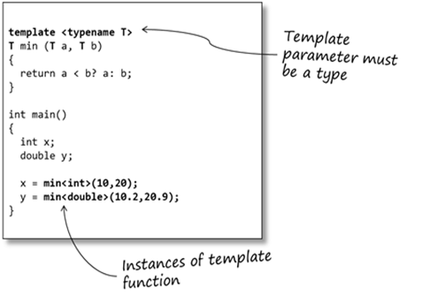

# Lecture 8: Operator Overloading / Copy Control
## SCSC 장필식

---

# Enums

중간에 빼먹었군요 ㅎㅎ

"종류"를 표현하고 싶을때 사용

```cpp
enum Color {
    Red, Yellow, Green
}

struct TrafficLight {
    Color color = Green;
    float waitingTime = 1.0f;
}

TrafficLight light;
light.color = Red;
```

---

# enum class

enum class를 사용하면 enum에 이름을 지어 좀 더 코드를 깔끔하게 할 수 있다.

```cpp
enum class Color {
    Red, Yellow, Green
}

struct TrafficLight {
    Color color = Color::Green;
    float waitingTime = 1.0f;
}

TrafficLight light;
light.color = Color::Red;
```

---

# type of enum

enum은 default로 int값으로 표현된다.
```cpp
enum Color {
    Red, // = 0
    Yellow, // = 1
    Green, // = 2
}
```

int 대신 다른 정수 타입도 쓸 수 있다.

```cpp
enum Color : unsigned char {
    Red = 0x00,
    Yellow = 0x01,
    Green = 0x02
}
```

여기서 unsigned char는 (64비트 시스템에서) 1바이트 (혹은 8비트)를 차지함

---

# enum

각 Enum 값의 실제 숫자를 바꿀 수도 있다.
```
enum Settings {
    Option1 = 0,
    Option2 = 1.
    Option3 = 2, 
    Option4 = 4,
    ...
}
```

---

# 그럼 이젠 본격적인 내용 시작

---

# Polymorphism

Polymorphism이란?

하나의 공통된 인터페이스를 가지고 여러 개의 타입을 묘사하는 것.

---

# Polymorphism 예시

Subtype Polymorphism: 상속 개념을 이용해서 하나의 base class를 통해 다른 class들을 묘사한다.


---

# Polymorphism 예시

Parametric Polymorphism: min<T>라는 하나의 template 함수를 통해서 min<int>, min<double>등을 만들어낸다.



---

# Polymorphism

이것을 실현하는 데에는 크게 두 가지가 있는데... C++은 이걸 모두 제공한다.

- Subtype Polymorphism (Inheritance / Virtual Methods)
- Parametric Polymorphism (Templates)

---

# Inheritance (상속)

공통된 기능을 가지고 있는 여러 개의 클래스를 하나의 클래스로 묶는 행위

이점:
- 코드 중복을 줄임
- 프로그램을 읽고 이해하기 더 쉬워짐
    - (물론 상속 구조를 잘 만들었을 때의 이야기지만...)
- Virtual Method를 통해 Polymorphism을 적용할 수 있음

---

# Inheritance

Base class:

<span style="font-size: 80%;">

```cpp
class Person {
public:
    Person(const string& name, int age) : 
        name(name), age(age) {}
    
    virtual ~Person() = default; // virtual destructor
    
    void print() const {
        std::cout << "Name: " << name << std::endl;
        std::cout << "Age: " << age << std::endl;
    }

    string getName() { return name; }
    int getAge() { return age; }
    int getMoney() { return money; } 

protected:
    string name;
    int age;
    int money;
}
```

---

# Inheritance

Derived class:

<span style="font-size: 80%;">

```cpp
class Student : public Person {
public:
    Student(const string& name, int age, string school) : 
        Person(name, age), school(school) {}

    void print() const {
        Person::print();
        std::cout << "School: " << school << std::endl;
        std::cout << "Grades: " << std::endl;
        for (const auto& grade : grades) std::cout << grade << " ";
        std::cout << std::endl;
    }

    string getSchool() { return school; }
    vector<int> getGrades() { return grades; }

private:

    string school;
    vector<int> grades;
}
```

---

# Inheritance: Constructor

자식의 constructor가 부모의 field들을 초기화할 때에는 부모의 constructor로만 할 수 있다.

```cpp
    Student(const string& name, int age, string school) : 
        Person(name, age), school(school) {}
```

---

# Access Control and Inheritance

public 와 private 외에 protected라는 수식어가 하나 추가된다!

- public: 모두다 다 불 수 있음
- private: 해당 클래스만 볼 수 있음
- **protected: 해당 클래스와 이를 상속하는 클래스만 볼 수 있음**

---

# Person과 Student의 사용

```cpp
Person person("Bob", 32);
person.print(); // Person::print() is called

Student student("Dongsu", 21, "SNU");
student.print(); // Student::print() is called
```

---

# Person과 Student가 가지고 있는 데이터

Person : name, age
Student : (name, age), school, grades

Student는 Person의 데이터와 함께 Student만의 구체적인 정보도 갖고 있다.

---

# Derived-to-Base Conversion

```cpp
Person* person = new Student("Dongsu", 21, "SNU");
```

Person에 대한 포인터에 Student의 데이터를 저장할 수 있다!
이 때 person을 통해서는 Person의 필드 / 멤버들만 볼 수 있다.

```cpp
person->getName(); // OK
person->getSchool(); // Error
```

---

# Derived-to-Base Conversion rules

base-class reference / pointer 에만 derived object의 base-class part를 bind 할수 있다.

```cpp
Person* person = new Student("Dongsu", 21, "SNU");

Student student2("Youngjae", 20, "SNU");
person = &student2;

Person& person2 = student2;
```

---

# 근데 문제가 하나 있는데...

```cpp
Person *person = new Student("Dongsu", 21, "SNU");
person->print(); // Person::print()
```

이때 Student::print()가 출력되게끔 하고 싶다!
왜? 변수 person에 저장되어 있는 데이터는 실제로는 Student이니까!

---

# 예를 들어서

```cpp
class Person {..}
class Student : public Person {..}
class Professor : public Person {..}

std::vector<Person*> people = {
    new Person("Bob", 11),
    new Student("Dongsu", 21, "SNU"),
    new Professor("Gerald", 55, "SNU", "Germany")
}
for (const Person* person : people) {
    person->print();
}
```

이렇게 다양한 종류의 사람들을 하나의 컨테이너에 저장하고 하나의 일관된 방법으로 print할 수 있으면 얼마나 좋을까?

---

# 얘를 들어서

```cpp
class GameObject {...}
class Player : public Person {...}
class Enemy : public Person {...{

class Game {
private:
    void update() {
        for (const GameObject* obj : objects) {
            obj->update();
        }
    }

    std::vecctor<GameObject*> objects;
}
```

---

# Virtual Methods

```cpp
class Person {
public:
    Person(const string& name, int age) : 
        name(name), age(age) {}
    
    virtual ~Person() = default; // virtual destructor
    
    virtual void print() const { // make method virtual
        std::cout << "Name: " << name << std::endl;
        std::cout << "Age: " << age << std::endl;
    }
    ...
}
```

---

# Virtual Methods

"override"를 통해 부모의 virtual method 대신에 사용하는 함수라는 것을 나타낸다.

<span style="font-size: 85%;">

```cpp
class Student : public Person {
public:
    Student(const string& name, int age, string school) : 
        Person(name, age), school(school) {}

    virtual void print() const override { 
        Person::print();
        std::cout << "School: " << school << std::endl;
        std::cout << "Grades: " << std::endl;
        for (const auto& grade : grades) std::cout << grade << " ";
        std::cout << std::endl;
    }
    ...
}
```

---

# Pure Virtual Functions

부모의 virtual method을 구현해 놓지 않고 비워두면, 그 함수는 pure virtual function이 된다.

```cpp
class Person {
public:
    Person(const string& name, int age) : 
        name(name), age(age) {}
    
    virtual ~Person() = default; // virtual destructor
    
    virtual void print() = 0; // pure virtual function
    ...
}
```

---

# Abstract Classes

Pure virtual function을 갖고 있는 base class는 abstract class (추상 클래스)가 된다.

이 때 우리는 base class의 타입을 갖는 오브젝트를 생성할 수 없다! (메서드의 내용물이 구현되어있지 않기 때문에 사용 불가)

```cpp
Person person("Bob", 32); // Error!
Person* person = new Person("Bob", 32); // Error!
```

---

# Virtual destructor가 필요한 이유

```cpp
virtual ~Person() = default;
```

Polymorphism이 적용될 때 부모 대신 자식의 destructor가 실행되도록 해야 함.
이러기 위해서는 destructor를 virtual로 만들어야 한다.

<span style="font-size: 80%;">


```cpp
Person *person = new Person(); // same static and dynamic  type
delete person; // destructor for Person is called
person = new Student(); // different static and dynamic type
delete student; // destructor for Student called
```

---

# Interface classes

아무런 데이터를 가지고 있지 않고 abstract method들로 이루어진, 다른 클래스의 형태만 지정해 놓는 클래스이다.

```cpp
class Drawable {
public:
    virtual void draw() const = 0;
}

class Transformable {
public:
    virtual void move(float x, float y) = 0;
    virtual void rotate(float radians) = 0;
}
```

---

# Multiple Inheritance

```cpp
class Player : public Drawable, public Transformable {
public:
    virtual void draw() const override {
        ...
    }
}
```

SFML에서 많이 보게 되는 패턴 중 하나.

---

# Diamond Problem

```
     A
    / \
   B   C
    \ /
     D
```

하지만 다중상속을 사용할 때 다음과 같은 일이 일어나면 곤란하다.

Virtual inheritance로 해결할 순 있지만, 애초에 이런 상황이 안 나오게 하는게 중요하다.

---

# Templates

---

# Templates

C++의 최종병기

매우매우 강력하면서도 잘못 쓰면 터질 우려가 많다.

이 강의에서 모든 걸 가르치기엔 부족하다...

---

# Template이 필요한 이유

임의의 타입에 대한 함수를 만들고 싶을 때

<span style="font-size: 90%;">


```cpp
int compare(const std::string &v1, const std::string &v2) {
    if (v1 < v2) return -1;
    if (v2 < v1) return 1;
    return 0;
}
int compare(const double &v1, const double &v2) {
    if (v1 < v2) return -1;
    if (v2 < v1) return 1;
    return 0;
}
```

각 타입마다 손수 만들기 귀찮다...

---

# Template의 사용

```cpp
template <typename T>
int compare(const T &v1, const T &v2) {
    if (v1 < v2) return -1;
    if (v2 < v1) return 1;
    return 0;
}
```

---

# Template 함수 사용

```cpp
// T = int
cout << compare(1, 0) << endl;
// T = float
cout << compare(1.0f, 2.0f) << endl;
// T = vector<int>
cout << compare(vector<int>(1, 2), vector<int>(4)) << endl;
```

---

# Template의 작동 원리

``compare(1, 0)`` 을 부르면 ``compare`` 함수 template의 ``int``에 대한 구현이 자동으로 만들어진다.

즉 컴파일러는
```cpp
int compare(const int &v1, const int& v2) {
    if (v1 < v2) return -1;
    if (v2 < v1) return 1;
    return 0;
}
```
와 같은 함수를 컴파일 타임에 생성해 준다는 것이다.

---

# Template Type Parameters

```cpp
template <typename T>
T min(const T& v1, const T& v2) {
    return (v1 < v2) ? v1 : v2
}

min(1, 2);
min(
```

---

# Template Type Parameters

```cpp
template <typename T>
T foo(T* p) {
    T tmp = *p;
    // ...
    return tmp;
}
```

---

# Template Type Parameters

```cpp
template <typename T, typename U>
std::string toConcatString(const T& v1, const T& v2) {
    return v1.toString() + " " + v2.toString();
}
```

이 함수를 쓸 때 타입 T와 U는 toString()이라는 메서드를 가지고 있어야 한다.

---

# Variadic Templates

임의의 개수의 타입을 받는 함수도 만들 수 있다!

```cpp
template<typename T>
T adder(T v) { 
    return v;
}

template <typename T, typename... Args>
T add(T first, Args... args) {
    return first + add(args...);
}

int main() {
    int sum = adder(1, 2, 3, 4, 5);
    cout << sum << endl;
}
```

---

# Class Template

Template를 함수 뿐만 아니라 클래스에도 적용할 수 있다.

예를 들어서:

<span style="font-size: 80%;">

```cpp
template <typename T>
class Vec {
public:
    Vec() : length(0), capacity(1), data(new T[1]) {
        data = new T[1];
    }
    ~Vec() {
        delete[] data;
    }
    void push_back(const T& value) { ... }
    void print() { ... }
private:
    T* data;
    size_t length;
    size_t capacity;
};
```

STL의 자료구조들 (vector<T>, list<T>, map<T>, ... 등은 모두 이것으로 구현되어 있다.

---

# Template Specialization

특정한 타입에 대해서는 구현을 다르게 하고 싶을 때도 있다.

예를 들어서 우리의 Vector에 boolean 값들이 들어있다면 그냥 어레이에 저장하는 것  보다 더 효율적으로 저장하고 싶다!

크기 32짜리 boolean vector 를 저장한다고 하자.
그냥 어레이에 저장하면: 1 byte boolean * 32 = 32 bytes = 256 bits
빼곡하게 저장하면: 1 bit * 32 = 32 bits

---

# Template Specialization

<span style="font-size: 80%;">

```cpp
template <>
class Vec<bool> {
public:
    Vec() : length(0), chunkLength(1), data(new size_t[1]) {
        data = new T[1];
    }
    ~Vec() {
        delete[] data;
    }
    void push_back(const bool& value) { ... }
    void print() { ... }
private:
    
    std::uint64_t* data;
    size_t length;
    size_t chunkLength;
};
```

---

# Inheritance vs. Template

Inheritance와 Template을 이용한 polymorphism의 비교.

---

# toString, the Java way (virtual polymorphism)

```cpp
class Object {
public:
    virtual std::string toString() = nullptr;
};
```

---

# toString, the Java way (virtual polymorphism)

```cpp
template <typename T>
class Vec : public Object {
public:
    virtual std::string toString() override {
        std::string s = "(";
        for (int i = 0; i < len; ++i) {
            s += array[i];
            s += ", ";
        }
        s += ")";
        return s;
    }

    T* array;
    size_t len;
    ...
};
```

---

# toString, the Java way (virtual polymorphism)

<span style="font-size: 80%;">

```cpp
std::string toConcatString(const Object& obj1, const Object& obj2) {
    return obj1.toString() + " " + obj2.toString();
}

Vec<int> vec1 {1, 2, 3};
Vec<double> vec2 {1.0, 2.0, 3.0};
toConcatString(vec1, vec2);
```

---

# toString with templates

```cpp
template <typename T>
class Vec {
public:
    std::string toString() {
        std::string s = "(";
        for (int i = 0; i < len; ++i) {
            s += array[i];
            s += ", ";
        }
        s += ")";
        return s;
    }

    T* array;
    size_t len;
    ...
};
```

---

# toString with templates

```cpp
template<typename T, typename U>
std::string toConcatString(const T& obj1, const U& obj2) {
    return obj1.toString() + " " + obj2.toString();
}

Vec<int> vec1 {1, 2, 3};
Vec<double> vec2 {1.0, 2.0, 3.0};
toConcatString(vec1, vec2);
```

---

# 차이점

Inheritance

- 런타임에 실행될 메서드가 결정이 됨.
- 런타임 성능의 타격을 받음.

Templates

- 컴파일 타임에 실행될 메서드가 결정이 됨.
- 컴파일 속도와 실행 파일 크기의 타격을 받음.

둘 다 장점과 단점이 있다.

매우 자주 불리는 메서드에는 Template으로 해결하는 것이 훨씬 효율적이다.

---

# Template으로 할 수 있는 재밌는 것들

어떤 한 개발자가 C++로 노닥거리다가 엄청난걸 발견한다.

C++ Template가 **Turing Complete**하다는 것을.
즉 C++ Template만 가지고 모든 종류의 컴퓨터 **연산**을 할 수 있다!

---

# 예시

```cpp
#include <iostream>

template <unsigned int n>
struct factorial {
    enum { value = n * factorial<n - 1>::value }
};

template <>
struct factorial<0> {
    enum { value = 1 };
}

int main() {
    std::cout << factorial<10>::value << std::endl;
}
```

퀴즈: ``factorial<10>::value`` 를 계산하는데 걸리는 시간은?

---

# 컴파일 타임 프로그래밍

컴파일을 할때 ``factorial<10>::value``는 3628800라는 값으로 미리 계산되어 실행파일에 박혀진다.
즉 실제 프로그램을 실행하면 ``factorial<10>::value``를 계산하는데 시간을 소모하지 않는다!

---

# constexpr

아예 이걸 사람들이 너무 좋아해서...
컴파일 타임 프로그래밍을 더 쉽게 하기 위해 C++11/14에 기능들을 추가함

```cpp
#include <iostream>s

constexpr unsigned int factorial(unsigned int i) {
    return (i == 0)? 1 : i * factorial(i - 1);
}

int main() {
    std::cout << factorial(10) << std::endl;
}
```

---

# constexpr

컴파일 타임에 연산하는데 사용되는 변수를 지칭.

Template Metaprogramming와 같은 화려한 테크닉 이외에도, 곳곳에서 쓰이는 상수를 선언할때 쓰인다.

```cpp
constexpr float PI = 3.141592;

class Game {
public:
    static constexpr float WorldSize = 100;
    static constexpr float MaxLives = 3;
    ...
}
```

---

# 이외의 Template 관련된 테크닉들

- CRTP (The Curiously Recurring Template Pattern)
- SFINAE (Substitution Failure is Not An Error)

하지만 이걸 다 다루기에는 이 수업의 범위를 뛰어넘으므로 그냥 스킵하겠습니다...

---

# 여기까지

여기까지고 내용을 끝내고 마무리 짓도록 하겠습니다...

다루지 못한 부분들:
- STL I/O
- STL의 기타 특수한 부분들 (``<random>, <tuple>, <regex>``)
- C++ Exceptions (호불호가 갈리는 기능이여서 뺐음)
- virtual inheritance
- RTTI (Run-time Type Information)
- union
- C++17 일부 기능들 (std::optional, std::variant, ...)

---

# 끄으읕
